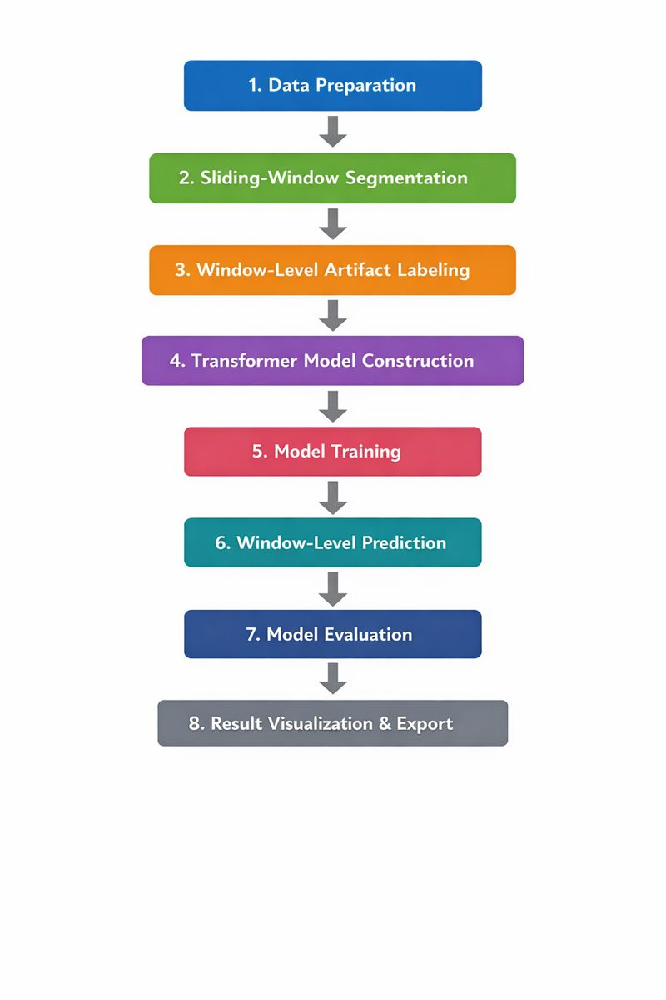
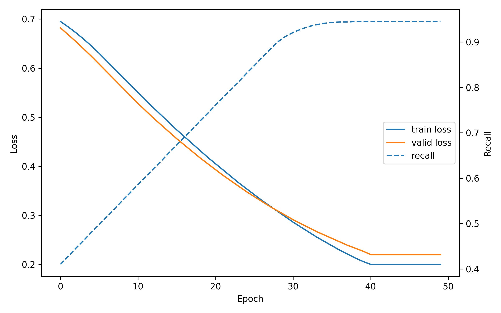
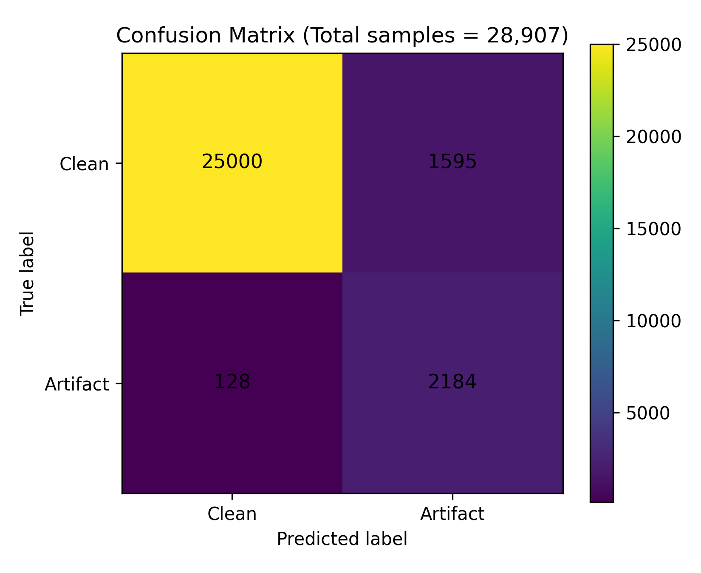

# Artifact Detection Using Transformer Based Time-series Models

A window-level artifact detection pipeline for physiological time-series data using modern transformer architectures


<p>
  
  
  
  
  
  
  
  
</p>

## Table of Contents

- [About](#about)
- [Features](#features)
- [Data](#data)
- [Method](#method)
- [Result](#result)
- [Quick Start](#quick-start)
- [Installation](#installation)
- [Project Structure](#project-structure)
- [Associated Publication](#associated-publication)
- [Contributing](#contributing)
- [Support](#support)
- [Acknowledgments](#acknowledgments)

## About

This repository implements a patient-aware, transformer-based artifact detection pipeline for physiological time-series data (RAP), using the previously defined residuals from ARIMA modeling. Continuous residuals are segmented into overlapping windows, labeled as clean or artifact based on within-window contamination, and aggregated across patients for model training.

Model performance is assessed using epoch-level training logs, loss–recall learning curves, and window-level confusion matrices computed exclusively on validation patients. The pipeline is implemented in Python using PyTorch, fastai, and tsai, and is designed as a robust foundation for artifact-aware preprocessing and downstream time-series analysis.

## Features

* 🪟 **Sliding-Window Time-Series Segmentation**: Converts continuous physiological signals (residuals) into overlapping fixed-length windows.
* 🤖 **Transformer-based Temporal Modeling**: Leverages transformer architecture to capture local and long-range temporal dependencies in residuals.
* 📉 **Recall-Focused Binary Classification**: Trains a supervised binary classifier optimized for artifact detection, prioritizing sensitivity to minimize missed artifacts.
* 📊 **Epoch-Level Training Diagnostics**: Records training and validation loss alongside recall metrics to monitor convergence and model behavior over epochs.
* 🧪 **Window-Level Prediction and Evaluation**: Generates artifact predictions for individual windows and evaluates performance using confusion matrices derived from validation data.
* 📈 **Visualizations**: Produces loss–recall learning curves and confusion matrices suitable for reporting and presentation.
* 🧩 **Modular and Extensible Pipeline**: Designed to support alternative windowing strategies, labeling thresholds, and downstream time-series or statistical analyses.


## Data

The data were retrospectively obtained from the TBI database prospectively maintained at the Multi-omic Analytics and Integrative Neuroinformatics in the HUman Brain (MAIN-HUB) Lab at the University of Manitoba. This study included patient data collected from January 2018 to March 2023. 


## Method

#### Workflow



#### Workflow (Extended)

```text

Window-Level Artifact Detection Using Transformer
│
├── 1. Data Preparation
│   ├── Load preprocessed physiological time-series signals (residuals)
│   └── Align signals temporally and handle missing values
│
├── 2. Sliding-Window Segmentation
│   ├── Segment continuous signals into overlapping windows
│   │     • Fixed window length
│   │     • Configurable step size
│   ├── Preserve temporal ordering within each window
│   └── Associate each window with corresponding timestamps
│
├── 3. Window-Level Artifact Labeling
│   ├── Identify artifact-contaminated samples using artifact timestamps
│   ├── Compute artifact proportion within each window
│   └── Assign binary labels:
│   │     • Clean window
│   │     • Artifact window (above contamination threshold)
│
├── 4. Transformer Model Construction
│   ├── Configure Transformer architecture (PatchTST)
│   ├── Treat artifact detection as a binary classification task
│   └── Produce a single logit per window
│
├── 5. Model Training
│   ├── Train using supervised binary classification
│   ├── Optimize using BCEWithLogits loss
│   └── Track recall to prioritize artifact sensitivity
│
├── 6. Window-Level Prediction
│   ├── Apply decision threshold to obtain binary predictions
│   └── Preserve window-level prediction alignment
│
├── 7. Model Evaluation
│   └── Quantify true positives, false positives, false negatives
│
├── 8. Result Visualization and Export
│   ├──  Export training logs and evaluation outputs for reporting
│   ├── Plot loss–recall learning curves
│   └── Visualize confusion matrix


```


## Result

#### Training Log



[Train log exported in CSV](result/patchtst/training_log_patchtst.csv)


#### Confusion Matrix




# Quick Start

Clone the repository and run the main script:

```bash
git clone https://github.com/Abrar-Islam-Oitijjho/Artifact-Detection-Using-Transformer-Based-Time-series-Models.git
cd Artifact-Detection-Using-Transformer-Based-Time-series-Models
pip install -r requirements.txt
cd code
jupyter notebook patchtst_main.ipynb
```

## Installation

### 🛠 Requirements

The notebook is written in Python and relies on standard scientific libraries:

* Python ≥ 3.11
* PyTorch
* NumPy
* Pandas
* fastai
* Matplotlib
* Seaborn
* Plotly

Exact versions can be adapted to local environments.

## Project Structure

```
Descriptive-Relationships-Between-Time-series-Variables/
├── code/
    ├── patchtst_main.ipynb       
    └── utils.py       
├── result/
    ├── patchtst/        
├── README.md              
└── requirements.txt                 
```

### ▶️ Usage

1. Clone the repository:

```bash
git clone https://github.com/your-username/your-repo-name.git
```

2. Open the notebook:

```bash
jupyter notebook descriptive_relationships_part1.ipynb
```

3. Execute cells sequentially to reproduce analyses and figures.

---

## Associated Publication

For more information please visit: [Characterization of RAP Signal Patterns, Temporal Relationships, and Artifact Profiles Derived from Intracranial Pressure Sensors in Acute Traumatic Neural Injury](https://www.mdpi.com/1424-8220/25/2/586)

#### 📄 Citation

If you use or build upon this work, please cite the associated publications.

---

## Contributing

Contributions are welcome!

### Quick Contribution Steps
1. 🍴 Fork the repository
2. 🌟 Create your feature branch (`git checkout -b feature/AmazingFeature`)
3. ✅ Commit your changes (`git commit -m 'Add some AmazingFeature'`)
4. 📤 Push to the branch (`git push origin feature/AmazingFeature`)
5. 🔃 Open a Pull Request

## Support

- 📧 **Email**: abraroitijjho35@gmail.com
- 🐛 **Issues**: [GitHub Issues](https://github.com/Abrar-Islam-Oitijjho/Descriptive-Relationships-Between-Time-series-Variables/issues)

## Acknowledgments
🌟 Special thanks: to the Main-Hub Laboratory, University of Manitoba, for their great support.
